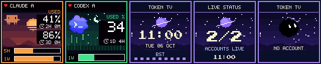

# TokenTV for Divoom Times Gate

Your AI usage limits across the **five screens of a Divoom Times Gate**. This public
adaptation of [TokenTV](https://github.com/click6067-ship-it/token-tv) adds native
128×128 layouts, animated appearances, one screen per subscription, and optional
weather. It uses the clock's local Wi-Fi API; no firmware flashing is needed.



*Pixel Retro with sample data. The gallery and preview show the complete 640×128 strip.*

Claude and Codex quotas come from their signed-in official CLIs. Grok CLI billing
budgets are also supported experimentally. You need Python 3.10+, a computer on the
same network as the clock, and a signed-in CLI for each service you want to display.
The computer must stay running to refresh usage and weather. This adaptation has
been used on a Times Gate with Linux; macOS and Windows hardware setups are untested.

## Get started

Set up the Times Gate's Wi-Fi in the Divoom phone app first, then clone **this** repository:

```sh
git clone https://github.com/raiscan/divoom-token-tv.git
cd divoom-token-tv
python3 -m venv .venv
.venv/bin/pip install -e .
```

Create a Times Gate configuration. Replace the example IP and timezone with yours;
setup asks which accounts to use and can reuse your existing CLI logins.

```sh
.venv/bin/token-tv setup --device-type times-gate \
  --device-url http://192.168.0.50 --timezone Europe/London \
  --config ~/.config/token-tv/times-gate.json

.venv/bin/token-tv run --config ~/.config/token-tv/times-gate.json \
  --times-gate-layout accounts \
  --local-token-file ~/.config/token-tv/times-gate-local-token.json
```

Open **http://127.0.0.1:8787**, choose an appearance under **Clock display**, and
select **Apply to clock**. **Preview** lets you inspect it without changing the device.
Setup never overwrites an existing configuration.

If prompted for a **Local Token**, find it in the phone app's Wi-Fi device list →
Times Gate card → **Settings …** → **Device Information**, beneath the IP address.
Update the phone app if that field is missing. Enter the token in the local dashboard;
it is stored in a separate file with owner-only permissions. A device-sharing QR
code is a different feature.

[Times Gate guide](docs/times-gate.md): service controls, refresh behaviour,
reserving screen 5 for built-in weather, the physical Mode button, and restoring
saved channel selections.

## Five screens, your choice

With `--times-gate-layout accounts`, each subscription gets one screen. Its **5H**
and **1W** bars are stacked, with separate reset countdowns. A service reporting
only one limit gets a larger number, meter, and character. Additional subscriptions
rotate as whole accounts. The default `windows` layout instead gives each reported
quota window its own screen.

Seven appearances work without additional artwork: **Pixel, Digital, Neon,
Pixel Retro, Sci-Fi HUD, Space, and Game Boy**. Space is animated. Pixel Retro keeps
its sunset and moon in proportion; Game Boy uses a four-shade LCD palette. Missing
readings stay unknown, and cached readings are visibly marked as stale.

## Optional Undertale and Deltarune appearances

The renderer supports two additional appearances when the required artwork is
installed locally. **Original game sprites and their extraction scripts are not
included in this repository**, and the app does not download them at runtime.
A fresh clone includes the seven standard appearances above; the game appearances
are listed only when their required local sprite files are present.

The current Deltarune setup uses this arrangement:

| Screen | Display |
| --- | --- |
| 1 | Claude's 5-hour and weekly quotas, with Susie |
| 2 | Codex's reported quotas, with Kris |
| 3 | Animated Dark Fountain clock |
| 4 | Ralsei's party/update status |
| 5 | Elnina and Lanino presenting current and next-day weather |

Deltarune shows **percent left**, with horizontal bars and looping-clock reset
icons. Characters perform shuffled ACT animations. If any fresh quota reaches
0% left, the character holds its DOWN pose until quota returns. Stale readings
bring in Darkner Gerson with **“I'M OLD!”**, retaining the cached numbers.
Undertale and the standard appearances show **percent used**.

The weather broadcast uses Open-Meteo forecasts in Celsius, matching the purple
battle layout with animated weather symbols. With the required local weather
artwork installed, stop the existing runner and use this example for Poole, UK;
change the city and coordinates for your own location:

```sh
.venv/bin/token-tv run --config ~/.config/token-tv/times-gate.json \
  --times-gate-layout accounts --times-gate-panels 1,2,3,4,5 \
  --forecast-city Poole --forecast-latitude 50.71429 --forecast-longitude -1.98458 \
  --local-token-file ~/.config/token-tv/times-gate-local-token.json
```

Select Deltarune in **Clock display**. The custom forecast occupies screen 5 while
the controller runs. Built-in Divoom weather is also available as a separate setup
with TokenTV controlling screens 1–4; see the [Times Gate guide](docs/times-gate.md).

[Local game appearances](docs/local-game-appearances.md) documents required artwork,
local storage, provenance, animation behaviour, and weather options. Game artwork
remains © Toby Fox and the games' artists, outside Git and the software license.

## Try it without a clock or accounts

```sh
.venv/bin/token-tv demo --out token-tv-demo
```

This writes the original 240×240 clock-face samples using synthetic readings.
The header image shows the native Times Gate adaptation. The
[upstream live demo](https://token-tv.vercel.app) demonstrates the original TokenTV
and does not include this repository's Times Gate additions.

## Development and credits

```sh
.venv/bin/python -B -m unittest discover -s tests -v
node --check token_tv/web/app.js
```

Start with [making a clock face](docs/clock-faces.md), the
[Game Boy example](examples/gameboy), or [adding a provider](docs/adding-a-provider.md).
The original 240×240 photo-display support remains available; its
[setup reference](docs/setup.md) and [hardware guide](docs/hardware-compatibility.md)
are retained from upstream.

Based on [click6067-ship-it/token-tv](https://github.com/click6067-ship-it/token-tv).
The Times Gate transport draws on
[Divoom Gaming Gate](https://github.com/adiastra/divoom-gaming-gate).
Software is [MIT licensed](LICENSE); bundled fonts retain their own license notices.
Credentials, device tokens, runtime state, and optional game artwork stay outside Git.
